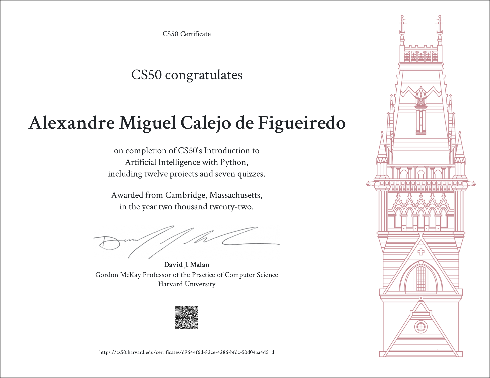

# CS50's Introduction to Artificial Intelligence with Python
https://cs50.harvard.edu/ai/2020/

## Welcome
This course explores the concepts and algorithms at the foundation of modern artificial intelligence, diving into the ideas that give rise to technologies like game-playing engines, handwriting recognition, and machine translation. Through hands-on projects, students gain exposure to the theory behind graph search algorithms, classification, optimization, reinforcement learning, and other topics in artificial intelligence and machine learning as they incorporate them into their own Python programs. By course’s end, students emerge with experience in libraries for machine learning as well as knowledge of artificial intelligence principles that enable them to design intelligent systems of their own.

## Certificate

## Projects

### Week 0 — Search

 - [Degrees](./lecture0/degrees/)
 - [Tic Tac Toe](./lecture0/tictactoe/)

### Week 1 — Knowledge

 - [Knights](./lecture1/knights/)
 - [Minesweeper](./lecture1/minesweeper/)

### Week 2 — Uncertainty

 - [PageRank](./lecture2/pagerank/) 
 - [Heredity](./lecture2/heredity/)

### Week 3 — Optimization

 - [Crossword](./lecture3/crossword/)

### Week 4 — Learning

 - [Shopping](./lecture4/shopping/)
 - [Nim](./lecture4/nim/)

### Week 5 — Neural Networks

 - [Traffic](./lecture5/traffic/)

### Week 6 — Language

 - [Parser](./lecture6/parser/)
 - [Questions](./lecture6/questions/)